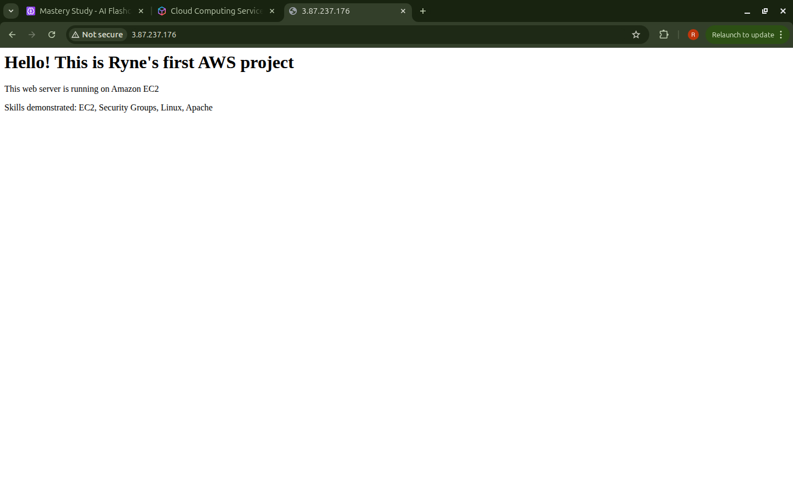
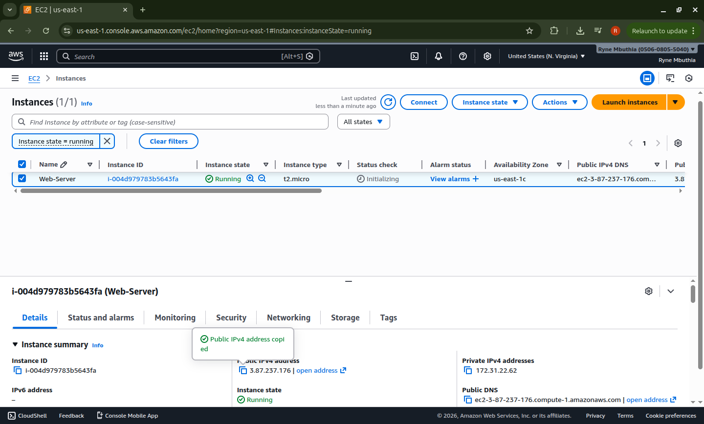
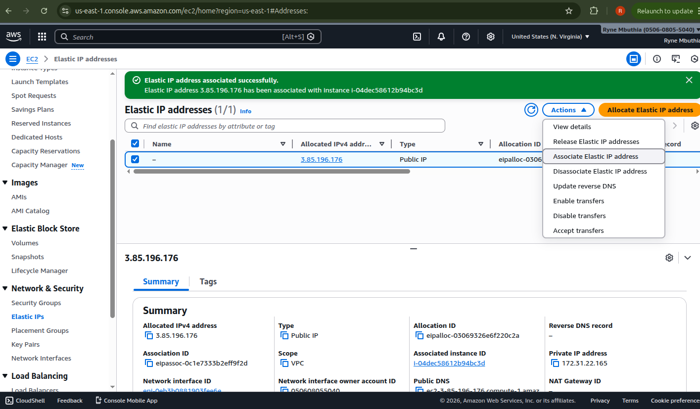

# AWS Project: Secure Web Server

## Overview
Deployed a web server on AWS EC2 with proper security configurations.

## Architecture
- **Service:** Amazon EC2
- **Instance Type:** t2.micro
- **OS:** Amazon Linux 2023
- **Web Server:** Apache (httpd)

## Security Configuration
- Created custom security group
- SSH access restricted to my IP only
- HTTP access open to public (port 80)
- Used key pair authentication for SSH

## Steps Taken
1. Launched EC2 instance in [your region]
2. Configured security group with least privilege principle
3. Connected via SSH using key pair
4. Installed and configured Apache web server
5. Created custom HTML page
6. Tested accessibility

## Skills Demonstrated
- EC2 instance deployment
- Security group configuration
- Linux command line
- SSH access management
- Web server installation

## Screenshot
## Apache Web Server Running

## EC2 Instance

### Security Group Configuration

### Elastic ip adddition

## What I Learned
- How to launch and configure EC2 instances
- Importance of security group rules
- Basic Linux administration
- SSH key pair authentication
- Elastic ip provide static public ip address
- AWS charge for idle Elastic ip so you need to associate it to an instance and release when not in use
- Elastic ips are used when white-listing or when you need a constant acess point